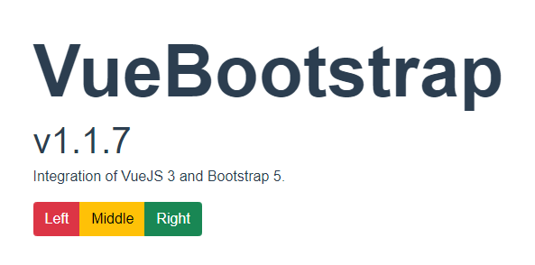

# vue-bootstrap

Example of **Vue 3** and **Bootstrap 5** integration. No more **jQuery**!!!

[Live Demo](https://vue-bootstrap-cloudrun-dev-iuj6vc72wa-uc.a.run.app/)

## Workflow

Project **building**, **testing**, and **deployment** information.

```sh
# Install dependencies
yarn install

# Compiles and hot-reloads for development
yarn serve

# Compiles and minifies for production
yarn build

# Lints and fixes files
yarn lint

# Build and execute Docker container
docker build -t vue-bootstrap:local -f Dockerfile .
docker run -it -p 8080:80 vue-bootstrap:local
```

Access the application at `localhost:8080`


